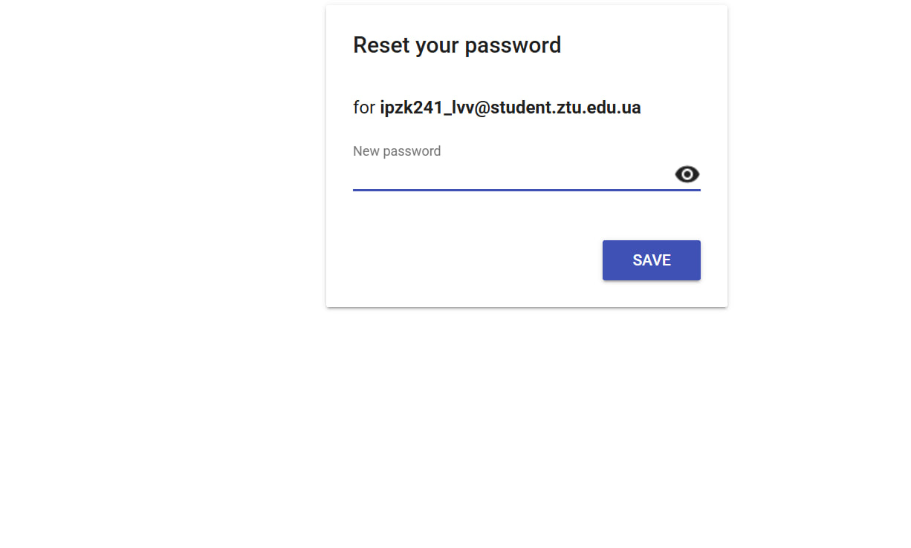
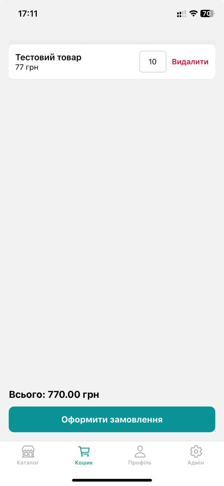
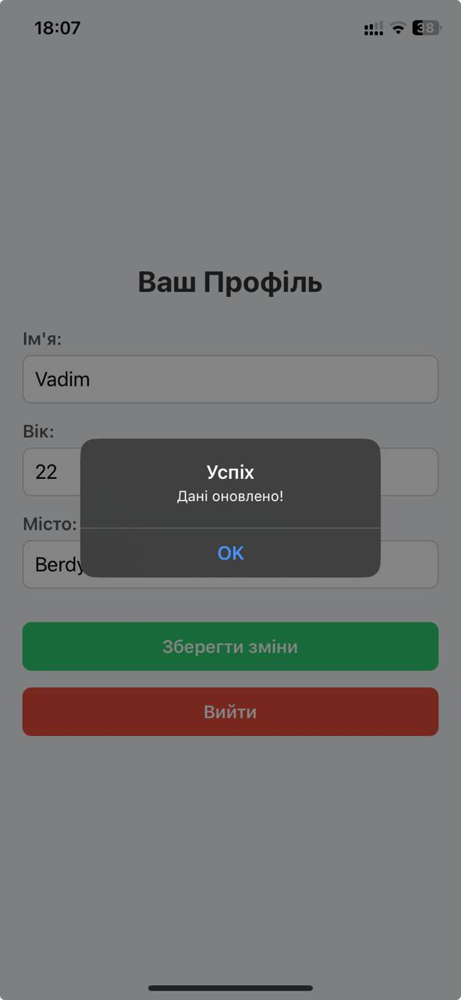
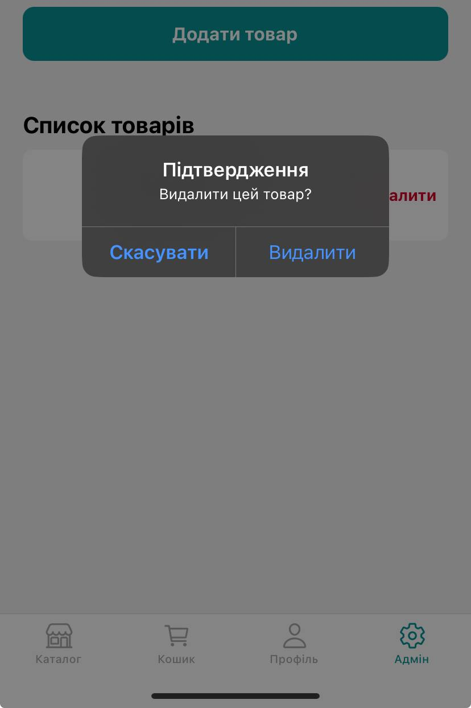
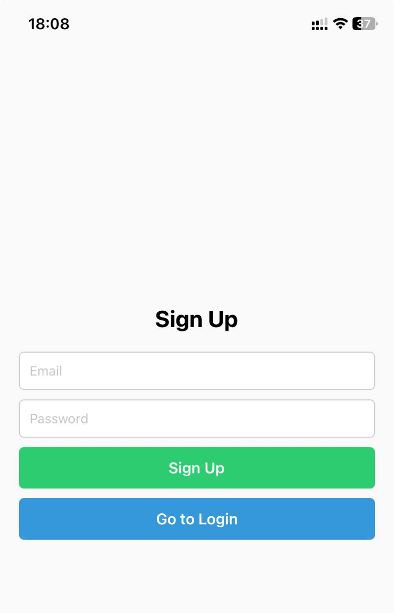
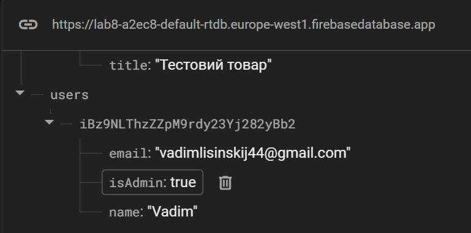

## Лабораторна 6

`Автор: Ліщинський Вадим, ІПЗк-24-1`
### Структура застосунку
- [HomeScreen](https://github.com/ipsolver/MobileLabsRN2025/blob/lab6/screens/HomeScreen.js) - головна сторінка профіля
- [LoginScreen](https://github.com/ipsolver/MobileLabsRN2025/blob/lab6/screens/LoginScreen.js) - сторінка для входу
- [LogoutScreen](https://github.com/ipsolver/MobileLabsRN2025/blob/lab6/screens/LogoutScreen.js) - вихід з акаунта
- [SignUpScreen](https://github.com/ipsolver/MobileLabsRN2025/blob/lab6/screens/SignUpScreen.js) - сторінка реєстрації

### Скріншоти застосунку

